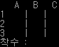

# minimax-tic-tac-toe


# Tree
```
.
├── ttt/
│   ├── agent/
│   │   └── base.py      : 에이전트 기본 인터페이스
│   ├── minimax/
│   │   └── minimax.py   : Minimax 알고리즘
│   ├── board.py         : Tic-Tac-Toe 게임판 구현 및 게임 현황
│   └── types.py         : 각 선수 및 돌의 좌표
└── play.py              : 사람과 봇 게임 진행
```

# How to Use
1. IDE 혹은 명령프롬프트를 이용하여 play.py 파일 실행  
   `python play.py`
2. 착수 위치를 열-행 순으로 입력(예를 들면 `B2`)
3. 2를 게임이 끝날때까지 반복

# Skills
- python3

# Release  
|Version|Date|Comments|
|---|---|---|
|1.0.0|2020-07-06|최초 제작|

<br>

---
  
<br>

#### 문의사항은 [Issue](https://github.com/vivaan-park/minimax-tic-tac-toe/issues) 페이지에 남겨주세요.
